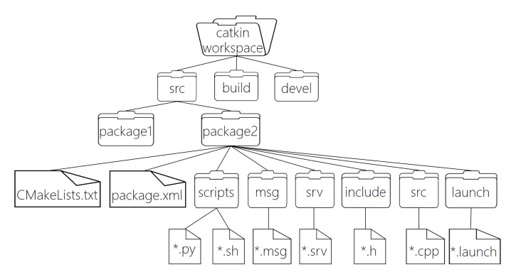

# 1、项目描述

```
catkin_ws ————工作空间
	|——— build/                                  # 编译空间，用于存放CMake和catkin的缓存信息、配置信息和其他中间文件
	|——— devel/                                  # 开发空间，用于存放编译后生成的目标文件，包括头文件、动态&静态链接库、可执行文件等
	|——— src/                                    # 源码
    |     |--- camera_pkg/                       # 图像话题发布（用于yolo11和tracking）
    |     |--- common_msgs_pkg/                  # 编码器数据和控制命令数据
    |     |--- gmapping_pkg/                     # 建图包
    |     |--- imu_pkg/                          # imu处理包
	|     |--- lsx10/                            # 激光雷达驱动文件
    |     |--- odom_pkg/                         # odom融合数据包
	|     |--- processdata_pkg/                  # 相机和雷达的数据进行处理融合操作（总处理）
	|     |--- radar_msgs/                       # 雷达消息数据
	|     |--- radar_pkg/                        # 雷达数据处理
    |     |--- serial_stm32_pkg/                 # 给stm32下发命令 
    |     |--- tracking_pkg/                     # 识别边界线导航
	|     |--- yolo11_pkg/                       # 相机视觉识别调用部分代码
	|     |--- CMakeLists.txt                    # 配置编译规则
    |     |--- radar_note.txt                    # 部分命令记录
```


# 2 、ROS基础

**ros文件系统如下所示：**



**准备步骤：**

```bash
//创建工作空间并初始化
mkdir -p catkin_ws/src
cd catkin_ws
catkin_make

//进入 src 创建 ros 包并添加依赖
cd src
catkin_create_pkg name_pkg roscpp rospy std_msgs

cd ./catkin_ws/src

//从src打开vscode
code .
//在包中的src下创建节点文件.cpp，进行编程
```

# 3、运行出rviz点云步骤

1，启动ros核心:`roscore`

插上雷达后，参考轮趣科技（自己的激光雷达的商家）提供的说明文档。

2，终端运行：`ll /dev/|grep ttyCH343USB`

3，终端运行：`sudo chmod 777 /dev/ttyCH343USB0`将接口的权限修改为最大；

4，启动雷达：`roslaunch lslidar_driver lslidar_serial.launch`

5，测试是否成功：`rostopic echo /scan`

5，运行rviz：`rviz`，选择参数，即可显示出点云；

# 4、雷达输出点云拟合的圆形花盆坐标

需安装：对应的库（yaml，rospkg，scikit-learn等库，不要装plt的库（没用到）），以后应该就不需要安装了；

在`roscore`和 `roslaunch lslidar_driver lslidar_serial.launch`的前提下，
```bash
conda activate pointcloud
rosrun radar_pkg PointCloudFitting_node.py
```
即可在终端输出花盆的极坐标信息；  

相机识别帧率大概50帧(FP16量化后)，激光雷达节点输出帧率为12帧；

# 5、相机和雷达数据的处理
相机节点运行：
```bash
conda activate yolo11
rosrun yolo11_pkg onnx.py
```

radar和yolo11发布节点，process_data中订阅节点并处理

数据关联->数据融合->选择最近的花盆->PID计算出PWM；

**运行：** `rosrun processdata_pkg processdata_node` 

# 6、串口通信
`sudo chmod 777 /dev/ttyTHS0`  
`rosrun serial_stm32_pkg serial_stm32_node _port:=/dev/ttyTHS0 _baud_rate:=115200`  
已实现

# 7.IMU
**串口号：** /dev/ttyUSB0;(`sudo chmod 777 /dev/ttyUSB1`)  
**帧率：** 10HZ;  
**topic:** yaw_angle;    
**运行：** `rosrun imu_pkg imu_node`

# 8.基于状态机的相机导航
**环境：** 不需要conda
**运行：** `rosrun tracking_pkg track.py`  

# 9.camera发布图像话题
`rosrun camera_pkg camera_pkg_node`


# 更新中。。。

# 注意：
1.在`rm -rf build devel`后重新进行编译时会因为包的编译依赖关系而报错：
```bash
catkin_make --pkg lslidar_msgs
catkin_make --pkg lslidar lslidar_driver
catkin_make --pkg yolo11_pkg   # 要在processdata_pkg之前
catkin_make --pkg radar_msgs
catkin_make --pkg common_msgs_pkg
catkin_make --pkg tracking_pkg
catkin_make --pkg processdata_pkg   
```